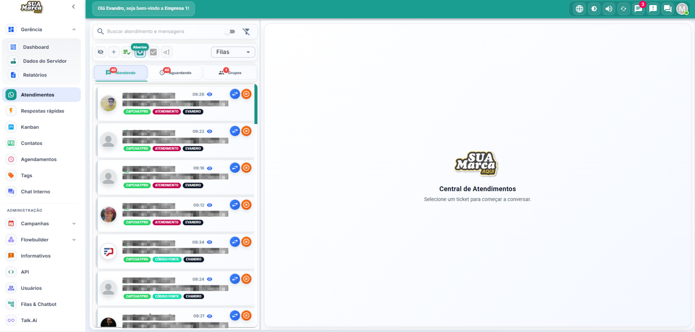
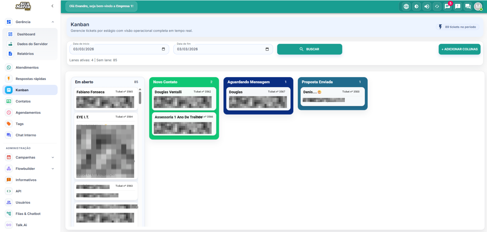
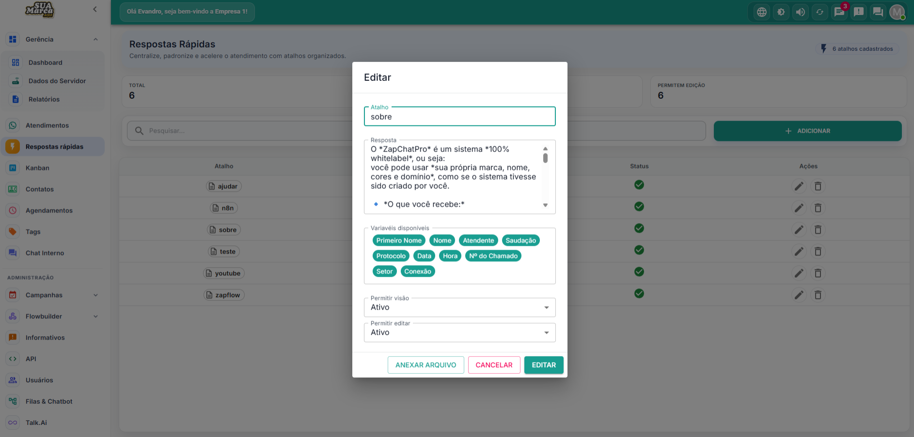
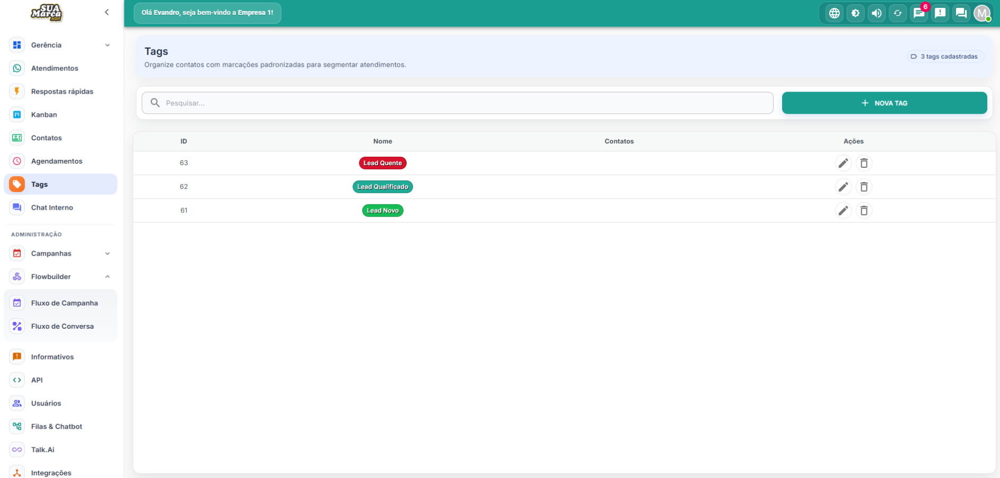

# 🚀 ZapChatPro – Sistema WhiteLabel de Atendimento via WhatsApp

O ZapChatPro é um sistema completo de atendimento multiusuário via WhatsApp, desenvolvido para empresas que desejam vender ou utilizar uma solução profissional com sua própria marca.

⚠️ Este repositório é apenas uma vitrine demonstrativa.  
O código-fonte completo é disponibilizado exclusivamente após a aquisição da licença.

---

## 🎯 Indicado para

- Empresas que desejam oferecer solução WhiteLabel
- Agências que querem vender sistema de atendimento
- Empreendedores que buscam renda recorrente com SaaS
- Negócios que precisam organizar equipe de atendimento
- Empresas que vendem serviços via WhatsApp

---

## ✨ Funcionalidades Principais

✔ Atendimento multiusuário  
✔ Dashboard com métricas em tempo real  
✔ Sistema de tickets organizado  
✔ Kanban de atendimentos  
✔ Respostas rápidas personalizadas  
✔ Envio de mensagens em massa  
✔ Agendamento de mensagens  
✔ Sistema de tags  
✔ Controle de usuários e permissões  
✔ Interface moderna e responsiva  
✔ Modo claro e escuro  

---

## 📊 Dashboard Inteligente

Acompanhe métricas de atendimentos, usuários ativos e produtividade da equipe.

---

## 💬 Atendimento Organizado

Sistema estruturado em tickets, permitindo que múltiplos atendentes trabalhem simultaneamente.

---

## 📌 Kanban Visual

Organize conversas por status e tenha controle total da operação.

---

## ⚡ Respostas Rápidas

Crie atalhos personalizados para acelerar o atendimento e aumentar a eficiência.

---

## 🗂 Organização com Tags

Classifique conversas e clientes para melhor gestão e segmentação.

---

## 🛠 Tecnologias Utilizadas

- Node.js  
- React  
- Banco de dados SQL  
- Docker  
- Arquitetura SPA moderna  

---

## 📦 Modelo de Licenciamento

O ZapChatPro é comercializado no modelo de **licença de uso do código-fonte**.

Após a aquisição, você recebe:

- Código-fonte completo
- Guia de instalação
- Suporte inicial para implantação
- Atualizações conforme plano contratado

---

## 🔐 Aviso Importante

Este repositório **não contém o código-fonte do sistema**.  
Ele serve exclusivamente para apresentação das funcionalidades da plataforma.

---

## 💼 Oportunidade de Monetização

Ideal para quem deseja:

- Criar seu próprio SaaS
- Trabalhar com mensalidades recorrentes
- Revender sistema WhiteLabel
- Escalar operação com clientes empresariais

---

## 📞 Como Adquirir

Para adquirir a licença do ZapChatPro:

👉 Acesse: https://zapchatpro.com.br  
👉 Ou entre em contato via WhatsApp  

---

© 2026 ZapChatPro  
Todos os direitos reservados.
